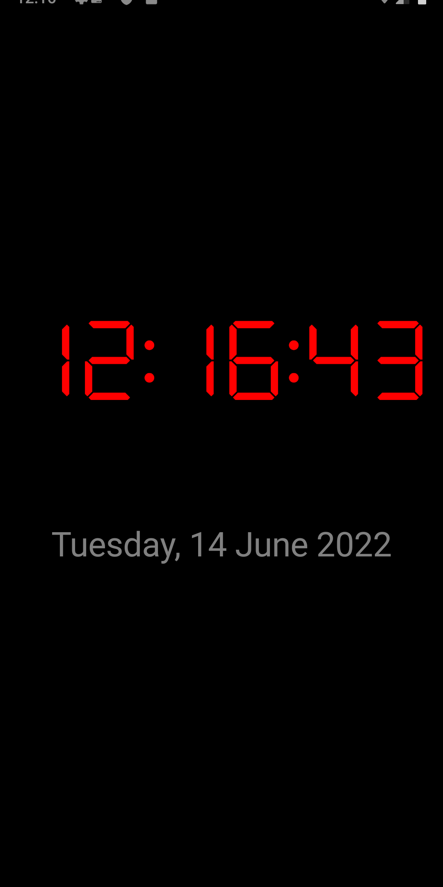
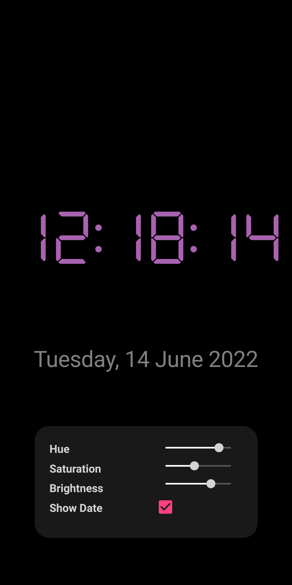
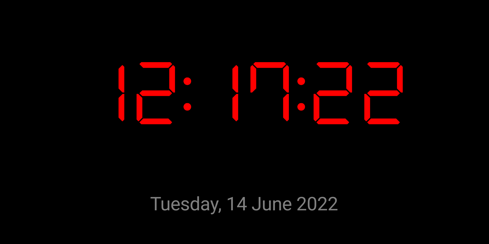

# Android Clock
This is an android application which serves as a retro-styled customizable desktop clock. It is built using Microsoft's Xamerin C# framework. This application responds to device rotation and tap gestures. It also features haptic feedback.

 

  

## Code
### ViewModel
```C#
using System;
using System.Collections.Generic;
using System.Text;
using System.ComponentModel;
using Xamarin.Forms;
using Xamarin.Essentials;
using System.IO;

namespace DesktopClock.ViewModels
{
    class MainPageViewModel : INotifyPropertyChanged
    {
        public string TimeString { get => timeString; set { timeString = value; PropertyChanged?.Invoke(this, new PropertyChangedEventArgs(nameof(TimeString))); } }
        public bool EnableDate { get => enableDate; set { enableDate = value; PropertyChanged?.Invoke(this, new PropertyChangedEventArgs(nameof(EnableDate))); } }
        public string DateString { get => dateString; set { dateString = value; PropertyChanged?.Invoke(this, new PropertyChangedEventArgs(nameof(DateString))); } }
        public Color Color { get => textColor; set { textColor = value; PropertyChanged?.Invoke(this, new PropertyChangedEventArgs(nameof(Color))); } }
        public double Hue { get => hue; set { hue = value; UpdateColorHSV(); PropertyChanged?.Invoke(this, new PropertyChangedEventArgs(nameof(Hue))); } }
        public double Saturation { get => saturation; set { saturation = value; UpdateColorHSV(); PropertyChanged?.Invoke(this, new PropertyChangedEventArgs(nameof(Saturation))); } }
        public double Value { get => value; set { this.value = value; UpdateColorHSV(); PropertyChanged?.Invoke(this, new PropertyChangedEventArgs(nameof(Value))); } }
        
        private DateTime time;
        private string timeString;
        private bool enableDate = true;
        private string dateString;
        private double hue;
        private double saturation = 1;
        private double value = 1;
        private Color textColor = Color.Red;

        public event PropertyChangedEventHandler PropertyChanged;

        const string saveFileName = "DesktopClockSettings";

        public MainPageViewModel()
        {
            Device.StartTimer(TimeSpan.FromMilliseconds(250), () =>
            {
                Device.BeginInvokeOnMainThread(() =>
                {
                    UpdateTime();
                });

                return true;
            });

            LoadSettingsFromFile();
        }

        private void UpdateTime()
        {
            time = DateTime.Now;
            TimeString = time.ToString("HH:mm:ss");

            if (enableDate)
            {
                DateString = time.ToString("dddd, dd MMMM yyyy");
            }
        }

        private void UpdateColorHSV()
        {
            Color = Color.FromHsv(Hue, Saturation, Value);
        }
        public void SaveSettings()
        {
            try
            {
                string fileName = Path.Combine(Environment.GetFolderPath(Environment.SpecialFolder.LocalApplicationData), saveFileName);

                using (var stream = File.Open(fileName, FileMode.Create))
                {
                    using (var writer = new BinaryWriter(stream, Encoding.UTF8, false))
                    {
                        writer.Write(Hue);
                        writer.Write(Saturation);
                        writer.Write(Value);
                        writer.Write(EnableDate);
                        Console.WriteLine($"Saved data to file: H:{Hue} S:{Saturation} V:{Value} Date:{EnableDate}");
                    }
                }
            }
            catch
            {
                Console.WriteLine("Failed to save settings.");
            }
        }

        public void LoadSettingsFromFile()
        {
            try
            {
                string fileName = Path.Combine(Environment.GetFolderPath(Environment.SpecialFolder.LocalApplicationData), saveFileName);
                if (File.Exists(fileName))
                {
                    using (var stream = File.Open(fileName, FileMode.Open))
                    {
                        using (var reader = new BinaryReader(stream, Encoding.UTF8, false))
                        {
                            Hue = reader.ReadDouble();
                            Saturation = reader.ReadDouble();
                            Value = reader.ReadDouble();
                            EnableDate = reader.ReadBoolean();
                            UpdateColorHSV();
                            Console.WriteLine($"Loaded data from file: H:{Hue} S:{Saturation} V:{Value} Date:{EnableDate}");
                        }
                    }
                }
            }
            catch
            {
                Console.WriteLine("Failed to load settings.");
            }
        }
    }
}

```

### View
```C#
using System;
using System.Collections.Generic;
using System.Linq;
using System.Text;

using Xamarin.Forms;
using DesktopClock.ViewModels;
using Xamarin.Essentials;
using System.IO;
using System.ComponentModel;

namespace DesktopClock.Views
{
    public class MainPageView : ContentPage
    {
        public ItemsLayoutOrientation Orientation => orientation;
        public bool EnableOptions => enableOptions;

        private MainPageViewModel viewModel;
        private AbsoluteLayout mainLayout;
        private StackLayout clockLayout, optionsLayout, inputColumn;
        private Label dateLabel, timeLabel;
        private bool enableOptions;
        private ItemsLayoutOrientation orientation;
        private Frame optionsFrame;

        const int labelColumnWidth = 150;
        const int valueColumnWidth = 200;
        const int totalWidth = labelColumnWidth + valueColumnWidth;
        const int labelFontSize = 15;
        const int optionsHeight = 150;

        public MainPageView()
        {
            viewModel = new MainPageViewModel();
            BindingContext = viewModel;
            Content = InitializeMainPage();
            SetOrientation(ItemsLayoutOrientation.Vertical);
        }

        private View InitializeMainPage()
        {
            BackgroundColor = Color.Black;

            mainLayout = new AbsoluteLayout();

            // Initialize tap gestures
            TapGestureRecognizer tap = new TapGestureRecognizer();
            tap.NumberOfTapsRequired = 1;
            tap.Tapped += OnTap;

            TapGestureRecognizer doubleTap = new TapGestureRecognizer();
            doubleTap.NumberOfTapsRequired = 2;
            doubleTap.Tapped += OnDoubleTap;

            mainLayout.GestureRecognizers.Add(tap);
            mainLayout.GestureRecognizers.Add(doubleTap);

            InitializeTimeDisplay();
            mainLayout.Children.Add(clockLayout, new Rectangle(0.5, 0.5, 1, 1), AbsoluteLayoutFlags.All);

            InitializeOptionsDisplay();
            mainLayout.Children.Add(optionsFrame, new Rectangle(0.5, 0.9, totalWidth, optionsHeight), AbsoluteLayoutFlags.PositionProportional);
            
            SetOptionsEnabled(false);

            return mainLayout;
        }

        private void InitializeTimeDisplay()
        {
            clockLayout = new StackLayout();
            clockLayout.Orientation = StackOrientation.Vertical;
            clockLayout.VerticalOptions = LayoutOptions.CenterAndExpand;
            clockLayout.HorizontalOptions = LayoutOptions.CenterAndExpand;

            timeLabel = new Label();
            timeLabel.SetBinding(Label.TextProperty, nameof(MainPageViewModel.TimeString));
            timeLabel.SetBinding(Label.TextColorProperty, nameof(MainPageViewModel.Color));
            timeLabel.FontFamily = "DSEG7Classic-Regular.ttf";
            timeLabel.HorizontalTextAlignment = TextAlignment.Center;
            timeLabel.VerticalTextAlignment = TextAlignment.Center;
            timeLabel.VerticalOptions = LayoutOptions.Center;
            timeLabel.HorizontalOptions = LayoutOptions.FillAndExpand;
            timeLabel.Margin = new Thickness(0, 100);

            dateLabel = new Label();
            dateLabel.SetBinding(Label.TextProperty, nameof(MainPageViewModel.DateString));
            dateLabel.SetBinding(Label.IsVisibleProperty, nameof(MainPageViewModel.EnableDate));
            dateLabel.FontSize = 30;
            dateLabel.HorizontalTextAlignment = TextAlignment.Center;
            dateLabel.TextColor = Color.Gray;
            dateLabel.VerticalTextAlignment = TextAlignment.End;
            dateLabel.VerticalOptions = LayoutOptions.Center;
            dateLabel.HorizontalOptions = LayoutOptions.CenterAndExpand;
            dateLabel.Margin = new Thickness(0, 0, 0, 100);

            clockLayout.Children.Add(timeLabel);
            clockLayout.Children.Add(dateLabel);
        }

        private void InitializeOptionsDisplay()
        {
            optionsFrame = new Frame()
            {
                CornerRadius = 20,
                Padding = new Thickness(20, 20, 20, 0),
                BackgroundColor = Color.FromRgba(1.0, 1.0, 1.0, 0.1),
                VerticalOptions = LayoutOptions.FillAndExpand,
                HorizontalOptions = LayoutOptions.FillAndExpand
            };

            optionsLayout = new StackLayout()
            {
                Orientation = StackOrientation.Horizontal,
                VerticalOptions = LayoutOptions.FillAndExpand,
                HorizontalOptions = LayoutOptions.FillAndExpand,
                WidthRequest = totalWidth,
                HeightRequest = optionsHeight,
            };

            StackLayout labelColumn = new StackLayout() { Orientation = StackOrientation.Vertical, HorizontalOptions = LayoutOptions.FillAndExpand, WidthRequest = labelColumnWidth };
            labelColumn.Children.Add(new Label() { Text = "Hue", TextColor = Color.LightGray, FontSize = labelFontSize, FontAttributes = FontAttributes.Bold, WidthRequest = labelColumnWidth });
            labelColumn.Children.Add(new Label() { Text = "Saturation", TextColor = Color.LightGray, FontSize = labelFontSize, FontAttributes = FontAttributes.Bold, WidthRequest = labelColumnWidth });
            labelColumn.Children.Add(new Label() { Text = "Brightness", TextColor = Color.LightGray, FontSize = labelFontSize, FontAttributes = FontAttributes.Bold, WidthRequest = labelColumnWidth });
            labelColumn.Children.Add(new Label() { Text = "Show Date", TextColor = Color.LightGray, FontSize = labelFontSize, FontAttributes = FontAttributes.Bold, WidthRequest = labelColumnWidth });

            inputColumn = new StackLayout() { Orientation = StackOrientation.Vertical, WidthRequest = valueColumnWidth };
            Slider hueSlider = new Slider() { Maximum = 1, WidthRequest = valueColumnWidth, ThumbColor = Color.LightGray };
            hueSlider.SetBinding(Slider.ValueProperty, nameof(MainPageViewModel.Hue));
            inputColumn.Children.Add(hueSlider);

            Slider saturationSlider = new Slider() { Maximum = 1, WidthRequest = valueColumnWidth, ThumbColor = Color.LightGray };
            saturationSlider.SetBinding(Slider.ValueProperty, nameof(MainPageViewModel.Saturation));
            inputColumn.Children.Add(saturationSlider);

            Slider valueSlider = new Slider() { Maximum = 1, WidthRequest = valueColumnWidth, ThumbColor = Color.LightGray };
            valueSlider.SetBinding(Slider.ValueProperty, nameof(MainPageViewModel.Value));
            inputColumn.Children.Add(valueSlider);

            CheckBox enableDateCheckbox = new CheckBox();
            enableDateCheckbox.SetBinding(CheckBox.IsCheckedProperty, nameof(MainPageViewModel.EnableDate));
            inputColumn.Children.Add(enableDateCheckbox);

            optionsLayout.Children.Add(labelColumn);
            optionsLayout.Children.Add(inputColumn);

            optionsFrame.Content = optionsLayout;
        }

        protected override void OnSizeAllocated(double width, double height)
        {
            base.OnSizeAllocated(width, height);

            if (width > height) SetOrientation(ItemsLayoutOrientation.Horizontal);
            else SetOrientation(ItemsLayoutOrientation.Vertical);
        }

        private void SetOrientation(ItemsLayoutOrientation orientation)
        {
            this.orientation = orientation;

            if (timeLabel == null) return;

            switch (orientation)
            {
                case ItemsLayoutOrientation.Horizontal:
                    timeLabel.FontSize = 100;
                    break;

                case ItemsLayoutOrientation.Vertical:
                    timeLabel.FontSize = 70;
                    break;
            }
        }

        private void OnTap(object o, EventArgs args)
        {
            if (EnableOptions)
            {
                SetOptionsEnabled(false);
                viewModel.SaveSettings();
            }
            else
            {
                MessagingCenter.Send(Application.Current, "OnTap");
            }
        }

        private void OnDoubleTap(object o, EventArgs args)
        {
            MessagingCenter.Send(Application.Current, "OnDoubleTap");
            if (EnableOptions)
            {
                SetOptionsEnabled(false);
                viewModel.SaveSettings();
            }
            else
            {
                SetOptionsEnabled(true);
            }
        }

        private void SetOptionsEnabled(bool enableOptions)
        {
            this.enableOptions = enableOptions;

            if (enableOptions)
            {
                optionsFrame.InputTransparent = false;
                optionsLayout.InputTransparent = false;
                optionsFrame.FadeTo(1, 250, Easing.CubicInOut);
            }
            else
            {
                optionsFrame.InputTransparent = true;
                optionsLayout.InputTransparent = true;
                optionsFrame.FadeTo(0, 250, Easing.CubicInOut);
            }
        }
    }
}
```
